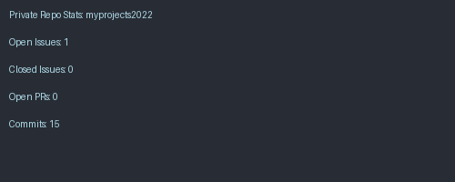

<!-- TOP LANG ICONS -->

  
  
  
  
  
  
  
  
  
  

---

# 👋 Hi, I’m Niresh Shanmugam

- 👷‍♂️ QA Manager | DevOps Engineer | Python Developer  
- 🌐 Building scalable test automation and cloud solutions  
- 🧪 Expert in protocol testing, Wi-Fi, CPE, Android STB & CI/CD pipelines  
- 🧑‍💻 Looking to collaborate on Python, Streamlit, and DevOps open-source projects  

---
## 📈 GitHub Statistics

## 📈 GitHub Contribution Graph

  

## 📦 PyPI Projects

  
  
  
  

  <strong>🎯 pytest-html-dashboard</strong> - Beautiful dashboard-style HTML reports for pytest with interactive charts, AI error analysis & real-time monitoring 
  
  
  

---

## 🧾 GitHub Repository Stats

### 🎯 pytest-html-dashboard (v1.2.0 - Latest)

  
  
  
  
  
  
  
  
  
  
  

### 📊 pytest-html-reporter

  
  
  
  
  
  
  
  

---

## 🔐 GitHub Private Repo Stats (Auto-Generated)

  

---

## 🧮 GitHub Stats (All Repos)

  
  

---

## 🐍 GitHub Contribution Snake

  

---

## 🌆 GitHub Skyline

  

---

## 👁‍🗨 Profile Views

  

