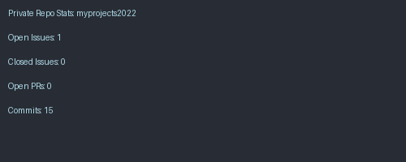

<!-- TOP LANG ICONS -->

  
  
  
  
  
  
  
  
  
  

---

# 👋 Hi, I’m Niresh Shanmugam

- 👷‍♂️ QA Manager | DevOps Engineer | Python Developer  
- 🌐 Building scalable test automation and cloud solutions  
- 🧪 Expert in protocol testing, Wi-Fi, CPE, Android STB & CI/CD pipelines  
- 🧑‍💻 Looking to collaborate on Python, Streamlit, and DevOps open-source projects  

---

## 📈 GitHub Contribution Graph

  

---

## 🧾 GitHub Public Repo Stats

  
  
  
  
  
  
  
  

---

## 🔐 GitHub Private Repo Stats (Auto-Generated)

  

> *Generated via GitHub Actions using API data from `myprojects2022`.*

---

## 🧮 GitHub Stats (All Repos)

  
  

---

## 👁‍🗨 Profile Views

  

---

## 📫 Reach Me
- LinkedIn: [nireshshanmugam](https://www.linkedin.com/in/nireshshanmugam)
- GitHub: [@nireshs](https://github.com/nireshs)

---

## 🛠️ Projects I’m Working On

- `pytest-html-reporter`: Pytest plugin for customizable HTML reports  
- `myprojects2022`: Microservices-based private project with Python, JS, CI/CD  
- Streamlit-based dashboards for QA & team management  

---
